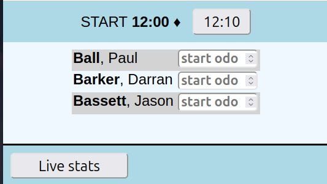
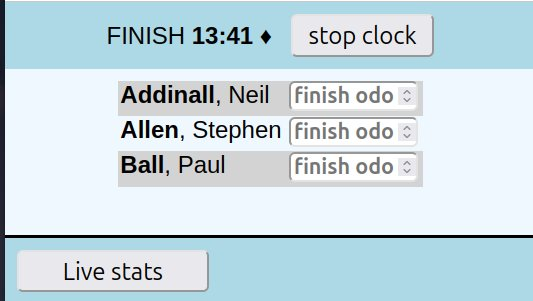
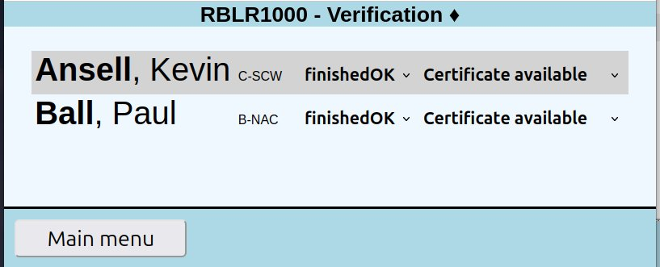

# ALYS - Custom RBLR software

Derived from but independent of ScoreMaster, this software provides comprehensive admin support for the RBLR1000 event run by IBAUK on behalf of the Royal British Legion.

## OVERVIEW

Entrants register for the event in advance using a web capture form hosted on wufoo.com. These details are cleaned using a separate application, Reglist (used for all IBAUK rallies), and loaded into the RBLR database with a status of "Registered" (see below). About a week before the event, all the rider certificates are printed and placed in named envelopes along with "Welcome to the IBA" materials. These are brought to Squires en masse. On the Friday of the RBLR weekend, the action physically moves to Squires and entrants are signed in as they arrive. On Saturday morning, signed-in entrants are checked out by team members using phones, iPads, etc. Saturday afternoon onwards, entrants return to Squires and are checked in by team members in the carpark, after which they go through verification and collect their certificates. Any deviations from the preprinted details result in new certificates being printed and posted after the event.

## TEAM MEMBERS

At Squires the event is running by a team from IBAUK plus volunteers from RBL. The RBL people are generally involved in managing things in the carpark, especially the checking-in process when entrants arrive back at Squires. IBA roles include signing in, check out and verification as well as recording known withdrawals throughout the weekend.

## ACCESSING ALYS
The software is running on an internet server. For full admininstration access, use [rblr.webrally.xyz/menu](https://rblr.webrally.xyz/menu). This access should be restricted to authorised IBA people only. The short form [rblr.webrally.xyz](https://rblr.webrally.xyz) should be used by those needing only check-out/check-in access.

## ENTRANT STATUS

In the database each entrant has a status code which is updated following his transition through the system.

- **registered** (aka 'not signed in') - expected but not at Squires yet
- **withdrawn** (before signing in, aka 'DNS') - not expected at Squires
- **signed in** at Squires
- **checked out** - [ still ] out riding
- **finisher** - checked in at Squires within 24 hours
- **late finisher** - checked in at Squires after 24 hours
- **DNF** - ride is abandoned, not returning to Squires

## SIGN IN (START)

Riders are registered online via Wufoo forms but on arrival at Squires they are signed in by staff who will:-

- check and confirm all details, recording amendments as necessary
- take charge of any cash or cheques handed in
- record details of payments made directly to RBL bank accounts or via JustGiving.com
- obtain signatures on disclaimers
- hand over receipt logs
- hand over pre-ordered t-shirts and patches

The list of riders shown at sign-in includes only those with a status of **Registered** or **Withdrawn**. The full list is always available via `[Full entrant list]`. The list is always shown in order of last name, first name.

## CHECK-OUT (START)

The check-out process involves capturing odo readings and thereby changing a rider's status to 'riding'.

Riders are released initially in cohorts starting at 0500, then at 10 minute intervals until 0530 or some other predetermined time after which the timestamp changes each minute.

The odo capture screen initially shows 05:00 and trips automatically to 05:10 at 05:01, to 05:20 at 05:11 and so on. Odo readings taken before 05:00 will show the rider as leaving at 05:00, not before.

The list of riders shown at check-out includes only those with a status of **signed-in**.

The screen itself is trivially simple, deliberately so.

"START" clearly indicates that this is check-out, not check-in. "12:00" is the current start time. The button showing "12:10" can be used to roll onto the next cohort.

Each rider is checked-out when his odo reading is input.

## CHECK-IN (FINISH)

On return to Squires, riders are checked in by team members in the carpark. Their odo reading is recorded and this action stops the clock on their ride. Their entrant status is updated to either **Finisher** or **Late Finisher** and the rider is sent off to prepare his paperwork ready for verification. A facility is provided to stop the real-time clock for two minutes so that, when a group of riders arrives back at once they'll all be given the same finish time.

The list of riders shown at check-in includes only those with a status of **checked-out** or **DNF**.

"FINISH" clearly indicates that this is check-in, not check-out. "13:41" is the current time. The button showing "stop clock" will freeze the clock for two minutes, useful when half a dozen riders all arrive back at the same time. Each of them can be credited with the same finish time. Their finish time is set when their odo reading is input.

## VERIFICATION (FINISH)

Each rider takes completed paperwork to the ride verifier who confirms the relevant details and rejects or accepts the ride. If a suitable certificate is available, it's given to the rider straightaway otherwise a record is made for reprint and posting.

The list of riders shown at verification includes only those with a status of **Finisher** or **Late Finisher**, with CertificateDelivered not "Y".

This is designed to be efficient enough to not need the full rider details. The options are to update the entrant's status, say from **Finisher** to **Late Finisher**, or to update the certificate status, typically to "Certificate delivered".

## LIVE STATS / CURRENT STATE OF PLAY

A button is provided to show the current state of play: numbers are shown for each (non-zero) entrant status and for total funds raised. A separate button shows the status of pre-ordered merchandise.

## MERCHANDISE 

A button is provided to show statistics about pre-ordered t-shirts and patches. It is assumed that anyone completing sign-in will also collect pre-ordered merchandise. No facilities are provided to handle any cash transactions or additional orders.

## EVENT SETUP

An administrative facility is provided to control parameters such as start times and whether the application is set for the start (Friday/Saturday AM) or finish (Saturday PM/Sunday).

When "Friday/Saturday AM" is showing, options for "SIGN IN" and "CHECK-OUT" are available. When "Saturday/Sunday" is showing, options for "CHECK-IN" and "Verification" are available. The setting should be changed over on Saturday morning, after all riders have been checked out and before any 500 mile riders return to Squires.

### Import entrants

Mechanism to import entrant details from a CSV created by the Reglist entry filtering application. Options include setting the value of _CertificateAvailable_ to 'Y' or 'N' and whether to add new entries only or reload the entire list.

### Export results for IBA database

Mechanism to export post-event details for inclusion in the main IBA UK Rides database.

### Settings

#### Earliest start time / extra cohorts / minutes between
Each rider's ride officially begins at the time recorded on his record during check-out. The time is controlled by these three values.

Riders are released in cohorts starting at the "Earliest start time". Check-out can be, and usually are, recorded before this time but riders won't be released until then.

Once the cohort times are passed, start times are assigned minute by minute.
